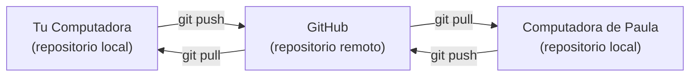
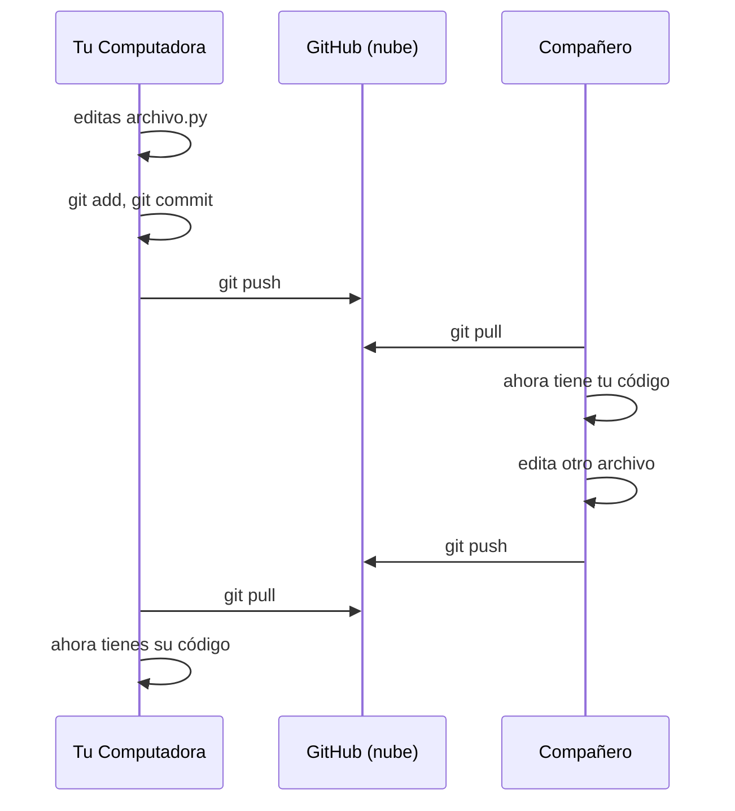

# 5️⃣ Colaboración en GitHub - Trabajo en Equipo

⏱️ **Tiempo recomendado:** 15 minutos

**Objetivo:** Aprender a trabajar en equipo usando push, pull y colaboración.

**Prerequisito:** Ya conectaste Git a GitHub en [doc 04](./04-CONECTAR-GITHUB.md)

---

## ¿Qué es GitHub?

Git es una herramienta en tu computadora.

**GitHub** es el servidor en línea donde subes tu código Git para que otros lo vean y colaboren.

### La Analogía Simple

```
Git local = Tu bloc de notas personal (en tu computadora)
GitHub = Tu mochila compartida en la nube (accesible desde cualquier lugar)
```

Ambos son Git, pero:
- **Git local** = Control de versiones en tu máquina
- **GitHub** = Control de versiones + colaboración en línea

---

## Los Conceptos Clave de GitHub

### 1. **Repositorio Remoto** 📡

Un repositorio remoto es tu proyecto guardado en los servidores de GitHub (en la nube).

**Tu flujo actual:**

```
1. Creas archivos en tu computadora
2. Haces commits locales (git add, git commit)
3. Subes a GitHub con git push
4. Compañeros descargan con git pull
```



### 2. **Clone** 🔄

Clonar significa descargar un repositorio completo de GitHub a tu computadora.

```bash
git clone https://github.com/alumno/proyecto.git
```

**Resultado:** Una copia completa del proyecto en tu máquina, lista para trabajar.

---

## El Flujo de Trabajo en GitHub

### Caso Real: Tu Proyecto Escolar

**Día 1 - Paula crea el proyecto:**

```
Paula en su computadora:
1. git add proyecto.py
2. git commit -m "Crear proyecto inicial"
3. git push
↓
GitHub: Almacena el código de Paula
```

**Día 1 - Carlos obtiene el proyecto:**

```
Carlos en su computadora:
1. git clone https://github.com/paula/proyecto.git
↓
Carlos ahora tiene la misma carpeta que Paula
```

**Día 2 - Ambos trabajan en paralelo:**

```
Paula trabaja en: movimiento.py
Carlos trabaja en: enemigos.py

Paula: git push
Carlos: git pull (obtiene cambios de Paula)
Paula: git pull (obtiene cambios de Carlos)
Carlos: git push
```

El código se fusiona automáticamente porque cada quién trabajó en archivos diferentes.

---

## Los 3 Nuevos Comandos de GitHub

Hasta ahora conoces en local:
- `git add`
- `git commit`

Ahora agregas 3 más para GitHub:

### `git push` - Sube tu trabajo

```bash
git push
```

**¿Qué hace?** Toma tus commits locales y los sube a GitHub.

**Cuándo usarlo:** Después de hacer commits finales que quieres compartir.

---

### `git pull` - Descarga trabajo de otros

```bash
git pull
```

**¿Qué hace?** Descargas los commits que tus compañeros subieron a GitHub.

**Cuándo usarlo:** Antes de empezar a trabajar, para asegurar que tienes lo más reciente.

---

### `git clone` - Descarga un proyecto completo

```bash
git clone https://github.com/usuario/proyecto.git
```

**¿Qué hace?** Copia un repositorio COMPLETO de GitHub a tu computadora (con todo el historial).

**Cuándo usarlo:** La primera vez que descargas un proyecto.

---

## 👥 Colaboración Real: 4 Estudiantes, 1 Proyecto

Imaginemos a 4 estudiantes en un equipo:

```
Paula, Carlos, Laura, Francisco
        ↓
  GitHub (repositorio compartido)
        ↑
Todos editan en paralelo sin pisar cambios del otro
```

**¿Cómo funciona?**

| Persona | Día 1 | Día 2 | Día 3 |
|---------|-------|-------|-------|
| Paula | `git clone` + crea main.py | `git push` | `git pull` + edita |
| Carlos | `git pull` | crea jugador.py + `git push` | `git pull` + edita |
| Laura | crea enemigos.py + `git push` | `git pull` + edita | `git push` |
| Francisco | `git pull` + edita pantalla.py | `git pull` + `git push` | `git pull` |

**¡Sin GitHub, sería un caos!** Con GitHub, cada cambio está registrado, sincronizado y seguro.

---

## 🎯 Protocolo Recomendado para Equipos

Cada vez que trabajes:

```bash
# MAÑANA - Al empezar
git pull                    # Descargar cambios recientes

# DURANTE EL DÍA
[editas tus archivos]
git add .
git commit -m "Tu mensaje descriptivo"

# TARDE - Antes de irte
git push                    # Subir tu trabajo
```

**Regla de Oro:** `pull` antes de trabajar, `push` cuando termines.

---

## 📊 Entendiendo Push y Pull en Diagrama

Cuando haces `git push` y `git pull`, esto sucede:



---

## 🚨 El Conflicto (No te asustes)

**Caso especial:** Si TÚ y tu compañero editan LA MISMA LÍNEA del mismo archivo, Git no sabe cuál versión guardar.

```
Archivo: main.py

Tu versión:     print("Hola Paula")
Versión de Carlos: print("Hola Carlos")

❌ Git no sabe cuál es la correcta
```

**Solución:** Git te muestra AMBAS versiones y tú eliges cuál guardar.

Este es un tema avanzado. Por ahora, **evitalo** asegurando que cada compañero edite archivos diferentes.

---

## 🔐 Privacidad y Seguridad

Cuando creas un repositorio en GitHub, puedes elegir:

- **Público:** Cualquiera puede ver tu código
- **Privado:** Solo tú y las personas que invites

Para tu proyecto escolar, pide a tu profesor si debe ser público o privado.

---

## 📌 Resumen: Los 3 Comandos Nuevos

```bash
git clone <url>    # Primera vez: descargar proyecto completo
git push           # Subir tu trabajo a GitHub
git pull           # Descargar trabajo de compañeros
```

Eso es TODO lo que necesitas para colaborar en GitHub.

---

## ✅ Checkpoints de Aprendizaje: GitHub y Control de Versiones Remoto

### Checkpoint 1: Git vs GitHub
- [x] Entiendo que Git es local y GitHub es la nube
- [x] Puedo explicar por qué GitHub es necesario para equipos
- [x] Sé que GitHub almacena y sincroniza código

### Checkpoint 2: El Comando Clone
- [x] Entiendo qué es clonar un repositorio
- [x] Sé que clone descarga el código COMPLETO con historial
- [x] Puedo usar: `git clone https://github.com/usuario/proyecto.git`

### Checkpoint 3: Push y Pull
- [x] Sé que `git push` sube cambios a GitHub
- [x] Sé que `git pull` descarga cambios de GitHub
- [x] Entiendo que debo `pull` antes de trabajar y `push` después

### Checkpoint 4: Protocolo de Equipo
- [x] Puedo seguir: `pull` → `work` → `push`
- [x] Entiendo por qué este orden evita conflictos
- [x] Sé que este flujo permite que 4 estudiantes trabajen en paralelo

### Checkpoint 5: Conflictos y Seguridad
- [x] Sé qué es un conflicto (editar la misma línea)
- [x] Entiendo que se evita fácilmente (editar archivos diferentes)
- [x] Sé que puedo elegir repositorio público o privado

## ✅ Checkpoint 6: GitHub Dominio Completo ✅

- [x] Puedo explicar los 3 conceptos clave de GitHub
- [x] Sé los 3 comandos nuevos de GitHub
- [x] Entiendo el flujo de colaboración
- [x] Sé cómo evitar conflictos
- [x] Estoy listo para mi entregable

---

## 💾 Guarda tu Progreso en Git


Ahora que completaste esta lección y marcaste todos los checkpoints, ejecuta estos comandos para guardar tu progreso en un commit y que el autograder te lo califique cuando hagas push.

```bash
git add docs/06-GITHUB-INTRO.md
git commit -m "Completo 06: GitHub Colaboración y Control de Versiones Remoto"
```

**Confirmación:** En tu terminal deberías ver:

```
[main xxxxxxx] Completo 06: GitHub Colaboración y Control de Versiones Remoto
 1 file changed, [X] insertions(+), [Y] deletions(-)
```

Una vez que veas el mensaje de confirmacion, no olvides ejecutar `git push` para que vayas viendo como el autograder va calificando tu progreso.

---

## 🎯 Siguiente Paso

¡Excelente! Completaste la lección de GitHub. 

**Ahora pasarás a tu entregable final:** [Documento 07: Tu Entregable Final](07-ENTREGABLE-ALUMNO.md)

En ese documento, reflejarás todo lo que aprendiste sobre Git y GitHub en un archivo personal `ALUMNO.md`.


## 🔗 Navegación

**← Anterior:** [Comandos Básicos de Git en Windows](./05-COMANDOS-BASICOS-WINDOWS.md)

**→ Siguiente:** [Tu Entregable: Archivo ALUMNO.md](./07-ENTREGABLE-ALUMNO.md)